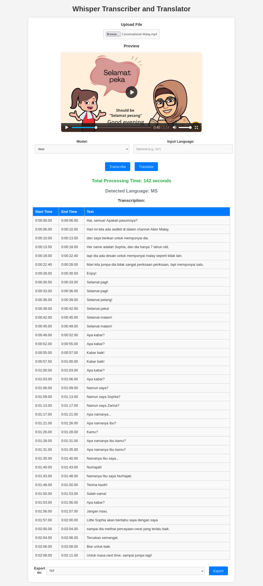

# Transcribe-Translate

<div align="center">

  [](#)
  [](https://notyusheng.github.io/Transcribe-Translate/)
  [](https://transcribe-translate-frontend.onrender.com/)

</div>
<div align="center">
  
</div>

<details>
  <summary>Full Page Sample</summary>
  <br>
  <div align="center">
    
  </div>
</details>

## Documentation
> [!WARNING]  
> Documentation is currently under development

You can access the project documentation at [[GitHub Pages](https://notyusheng.github.io/Transcribe-Translate/)].

## Host requirements
- **Docker**: [[Installation Guide](https://docs.docker.com/engine/install/)]
- **Docker Compose**: [[Installation Guide](https://docs.docker.com/compose/install/)]
- Compatibile with Linux and Windows Host
- Ensure port 3000 and 8000 are not already in use
- Project can be ran on either CPU or GPU

## Model requirements
The following table outlines the recommended hardware requirements for each Whisper model based on typical usage scenarios. Please ensure that your system meets or exceeds these specifications for optimal performance.

| Model      | Size (GB) | Minimum RAM (GB) | Recommended RAM (GB) | GPU Memory (VRAM) (GB) | Notes                                              |
|------------|:----------:|:----------------:|:--------------------:|:----------------------:|---------------------------------------------------|
| `tiny`     | ~0.07      | 2                | 4                    | 1                      | Suitable for lightweight tasks and low resource usage. |
| `base`     | ~0.14      | 4                | 6                    | 2                      | Good for basic transcription and smaller workloads. |
| `small`    | ~0.46      | 6                | 8                    | 4                      | Ideal for moderate tasks, offering a balance between performance and accuracy. |
| `medium`   | ~1.5       | 8                | 12                   | 8                      | Recommended for larger tasks with higher accuracy demands. |
| `large-v2` | ~2.88      | 10               | 16                   | 10                     | Best for high-performance tasks and large-scale transcription. |
| `large-v3` | ~2.88      | 12               | 16+                  | 10+                    | Highest accuracy and resource usage. Ideal for GPU-accelerated environments. |

> [!TIP]
> For models running on GPU, using CUDA-enabled GPUs with sufficient VRAM is recommended to significantly improve performance. CPU-based inference may require additional RAM and processing time.

> [!WARNING]
> By default, `base`, `base.en`, & `large-v3` models are loaded. Models can be configured from the `backend/Dockerfile`. However, `base` model must not be removed as it is statically configured to be the default model.

## Supported formats

### Import Options:
- Audio: `.mp3`, `.wav`, `.flac`, `.m4a`, etc.
- Video: `.mp4`, `.mkv`, `.avi`, `.mov`, etc.

### Export Options: 
- Users can export the results in `.txt`, `.json`, `.srt`, or `.vtt` formats.

## Usage
> [!NOTE]
> Project will run on GPU by default. To run on CPU, use the `docker-compose.cpu.yml` instead

1.  Clone this repository and navigate to project folder
```
git clone https://github.com/NotYuSheng/Transcribe-Translate.git
cd Transcribe-Translate
```

2. Configure the `frontend/.env` file
```
# IMPORTANT: Replace "localhost" with the server's IP address where the backend is running
REACT_APP_BACKEND_URL=http://localhost:8000
```  

3.  Build the Docker images:
```
docker-compose build
```

4.  Run images
```
docker-compose up -d
```

5.  Access webpage from host
```
<host-ip>:3000
```

API calls to Whisper server can be made to (refer to <host-ip>:8000/docs for more info)
```
<host-ip>:8000
```

## Additional Notes
> [!CAUTION]
> Project is intended to be use in a local network by trusted user, therefore there is **no rate limit configured and the project is vulnerable to request floods**. Consider switching to `slowapi` if this is unacceptable.

> [!TIP]
> For transcribing English inputs, `.en` version of the models are recommended
